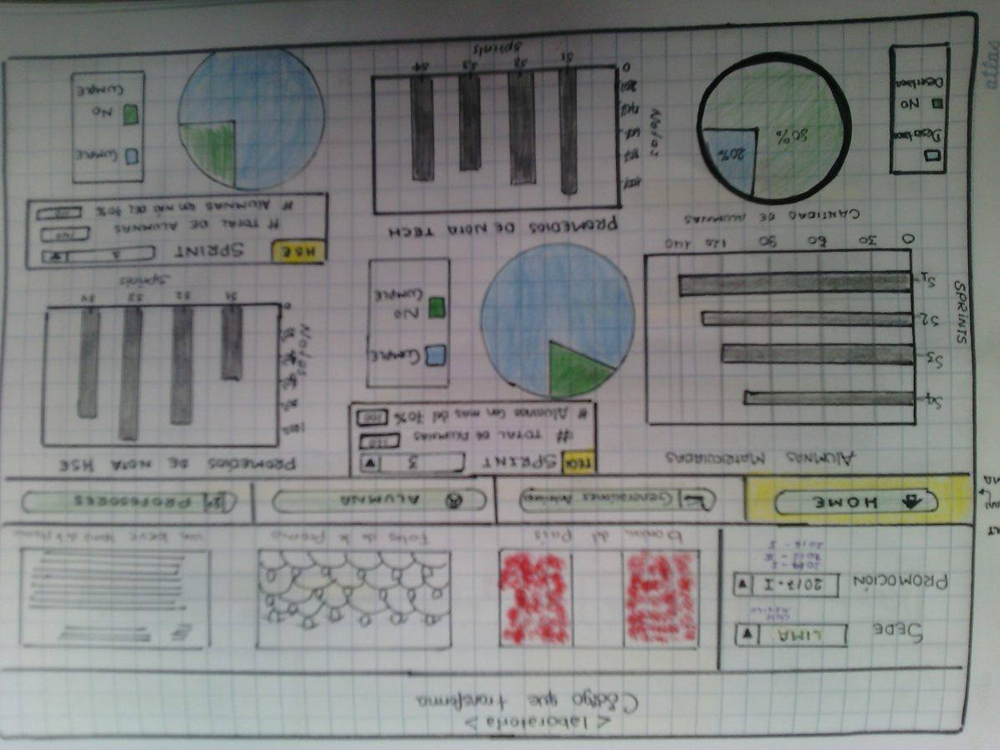
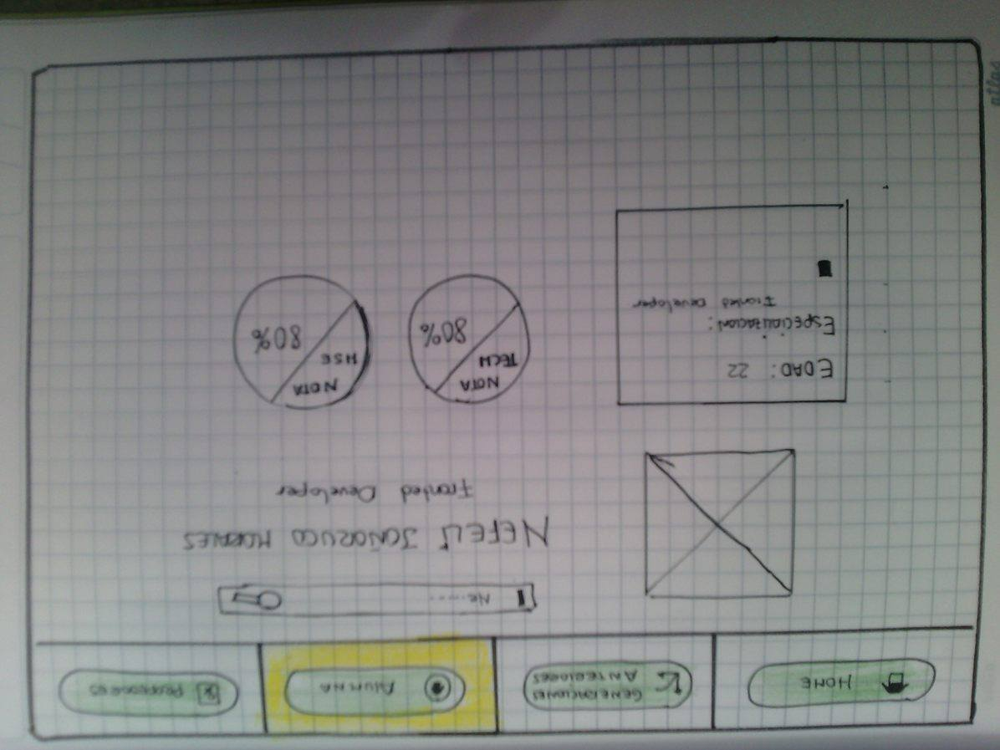

**Crea un sketch para la herramienta del dashboard de Laboratoria**

1. Numero de alumnas inscritas
2. Numero de alumnas que desertaron
3. Numero y % de alumnas que pasan el criterio mínimo de evaluación
4. Promedio de notas por sprint
5. Promedio de notas HSE
6. Promedio de notas técnicas
7. Además, dado que Laboratoria tiene muchas generaciones, regularmente 2 generaciones por año (estas generaciones empezaron en el 2014), y que opera en 4 sedes (Arequipa, Ciudad de México, Lima y Santiago de Chile), es posible que los usuarios quieran ver datos de sedes / generaciones anteriores para poder hacer comparaciones.

**En la primera ventana se muestra la primera seccion el logo de laboratoria, seguidamente con otra seccion donde se muestra la opcion de colocar la sede y promocion que quieres ver, inmediatamente se vera la bandera, la foto de las alumnas y una frase representativa a ellas junto con el cuadro de resumen de todos los graficos estadicos que deseamos ver.**

**Esta ventana se desliza de la primera al hacer click en el segundo boton de navegacion donde muestra una ocipon que te pregunta que deseas comparar al elegir una de las opciones automaticamente se mostrar el cuadro estadidtico comparativos por AÑO Y SEDES.**

**En la siguiente ventana podras observar la alumna que deseas ver y todas sus descripciones, esto es mas usados por los empleadores.**

